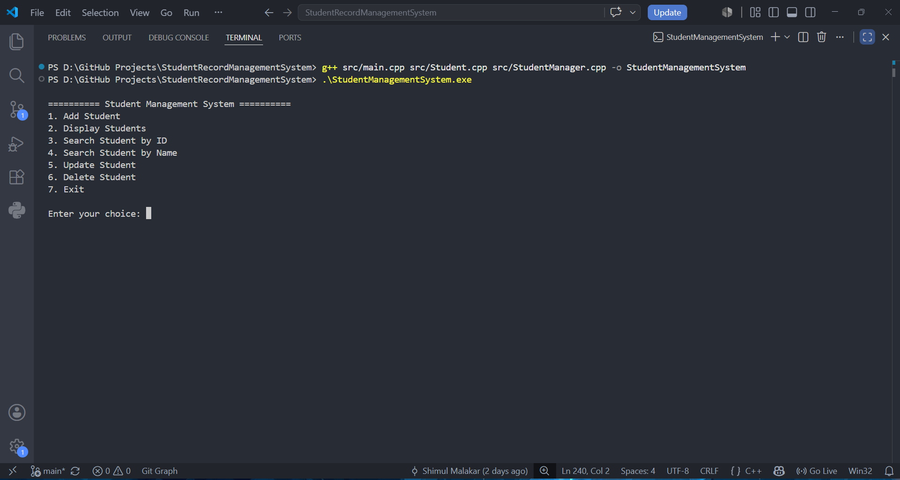
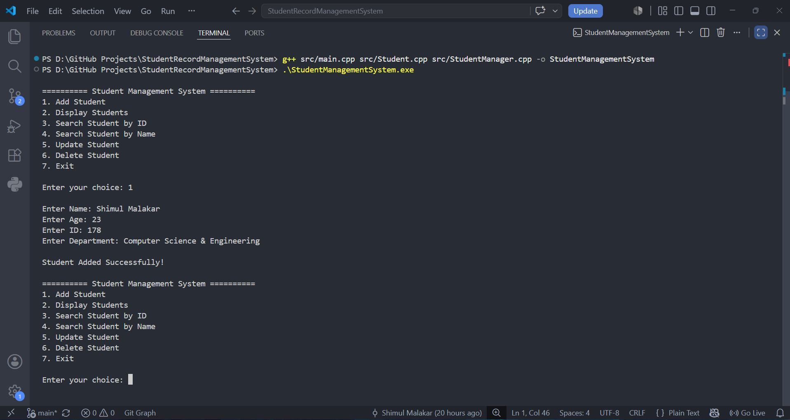
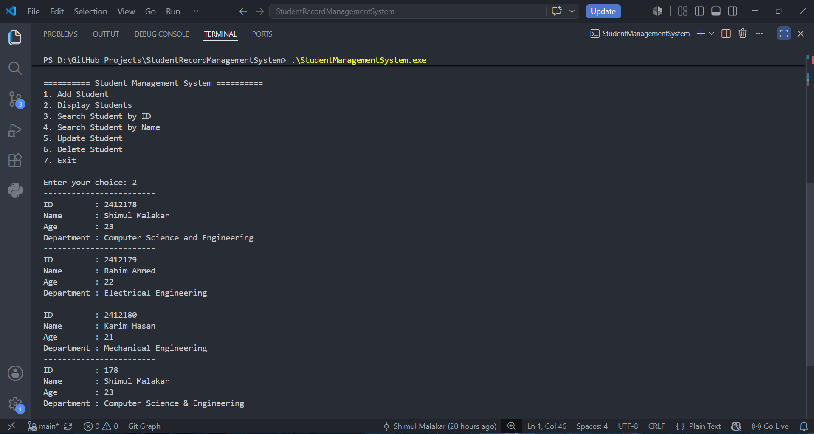
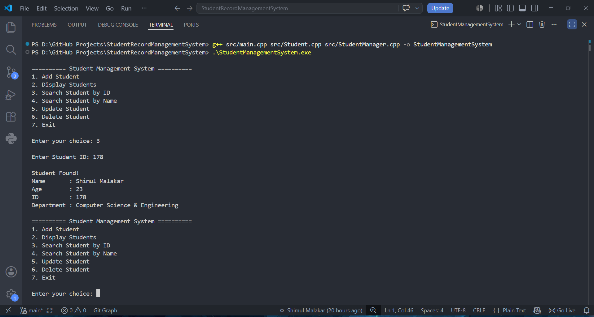
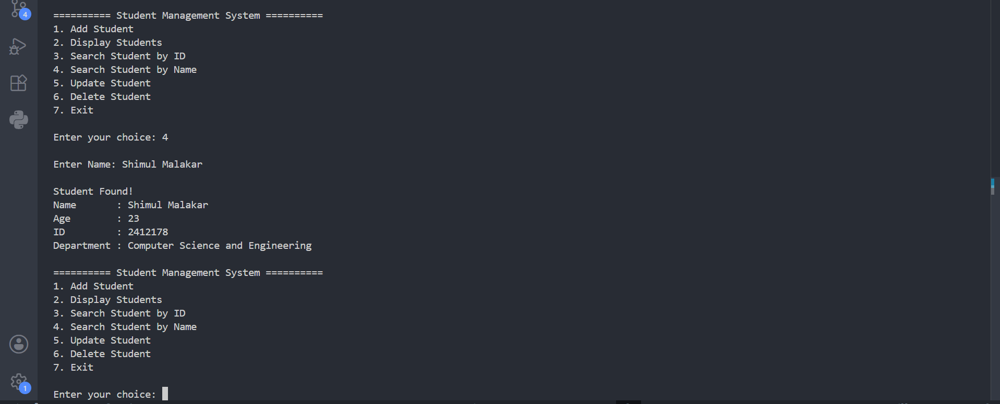
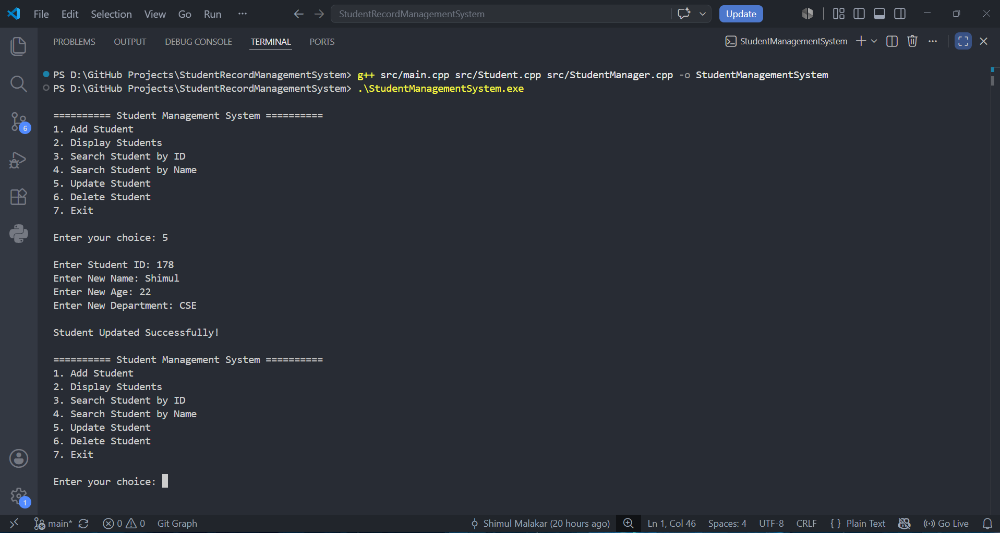
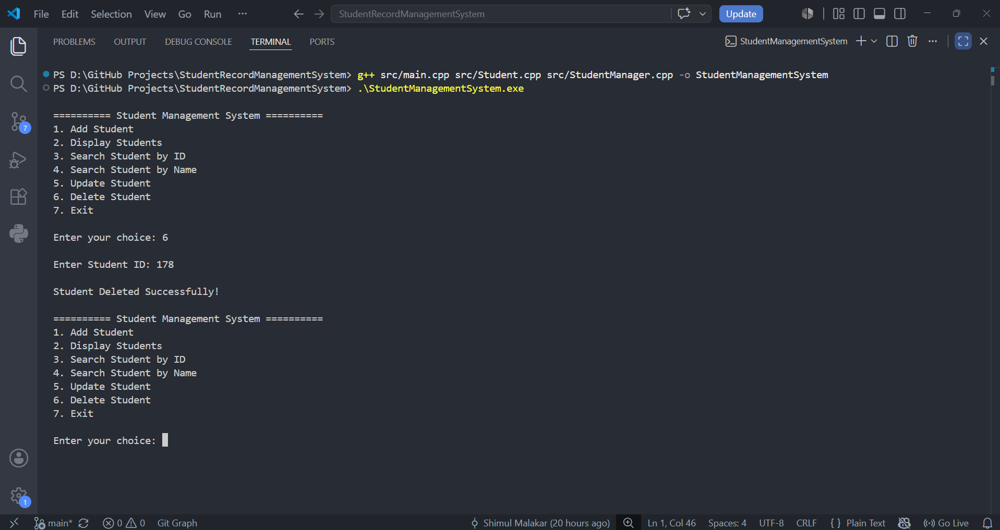

# 🎓 Student Record Management System (C++)

A console-based **Student Record Management System** developed in **C++** using **Object-Oriented Programming (OOP)** and **file handling**. The application allows users to manage student records with persistent storage.

---

## 🚀 Features

- ➕ Add Student
- 📋 Display All Students
- 🔍 Search Student by ID
- 🔎 Search Student by Name
- ✏️ Update Student Information
- ❌ Delete Student
- 💾 Automatic File Saving
- 📂 Persistent Data Storage
- 📝 Multi-word Input Support
- 🆔 Duplicate Student ID Prevention
- ✅ Input Validation

---

## 🛠️ Technologies Used

- C++
- Object-Oriented Programming (OOP)
- Standard Template Library (STL)
- File Handling
- Git
- GitHub

---

## 📁 Project Structure

```text
StudentRecordManagementSystem/
│
├── data/
│   └── students.txt
│
├── include/
│   ├── Student.h
│   └── StudentManager.h
│
├── src/
│   ├── main.cpp
│   ├── Student.cpp
│   └── StudentManager.cpp
│
├── images/
│   ├── home.png
│   ├── add-student.png
│   ├── display.png
│   ├── search-id.png
│   ├── search-name.png
│   ├── update.png
│   └── delete.png
│
├── .gitignore
├── LICENSE
└── README.md
```

---

## ⚙️ How to Compile

```bash
g++ src/main.cpp src/Student.cpp src/StudentManager.cpp -o StudentManagementSystem
```

---

## ▶️ Run the Program

```bash
./StudentManagementSystem
```

### Windows

```bash
StudentManagementSystem.exe
```

---

# 📸 Application Screenshots

## 🏠 Home Menu



---

## ➕ Add Student



---

## 📋 Display Students



---

## 🔍 Search Student by ID



---

## 🔎 Search Student by Name



---

## ✏️ Update Student



---

## ❌ Delete Student



---

## 📚 Concepts Demonstrated

- Object-Oriented Programming
- Classes and Objects
- Encapsulation
- Constructors
- Vectors (STL)
- Functions
- File Handling
- Input Validation
- CRUD Operations
- Searching Algorithms
- Basic Software Design

---

## 🔮 Future Improvements

- Login Authentication
- Sorting Students
- Export Data to CSV
- Better Exception Handling
- Graphical User Interface (GUI)
- Database Integration (MySQL)

---

## 👨‍💻 Author

**Shimul Malakar**

- GitHub: https://github.com/shimulmalakar

---

## 📄 License

This project is licensed under the MIT License.